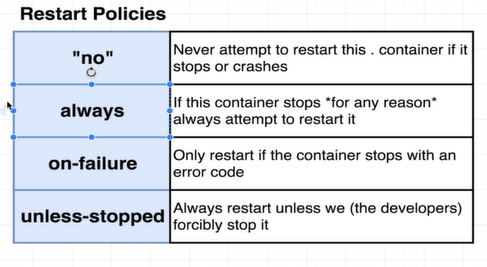

# Docker Basics

## Docker Commands

* docker run `<image>`
* docker run busybox ls
* docker ps
* docker run busybox echo `hi there` => hi there
* docker run busybox ping google.com
* docker run = docker create + docker start
* docker create `<image name>`
* docker start `<container id>`
* docker start -a `<container id>`
* docker run prune (To delete containers)
* docker logs `<container id>`
* docker create busybox ping google.com
* docker stop `<container id>`
* docker kill `<container id>`
* docker run redis
* redis-cli shutdown
* docker exec -it `<container id>` `<command>`
* docker exec -it `<container id>` redis-cli
* docker exec -it `<container id>` sh (ctrl + D to exit)
* docker run -it busybox sh
* docker build .
* docker build -t dininduchamikara/redis:latest
* docker run -p 8080:8080 `<image id>`

---------------------

### Writing a Dockerfile == Being given a computer with no OS and being told to install chrome

---------------------

### For windows users,

docker commit -c 'CMD ["redis-server"]' CONTAINERID

gives error like,

"/bin/sh:[redis-server] not found" or "No such container"

Insteed, try runnin the command like this:

docker commit -c "CMD 'redis-server'" CONTAINERID

------------------------

### Docker run with port mapping 

docker run -p 5000:8080 `<image id>`

here, 

5000 => route incomming request to this port on localhost to...

8000 => ...this port inside the container 

-----------------------

### Restart Policies

